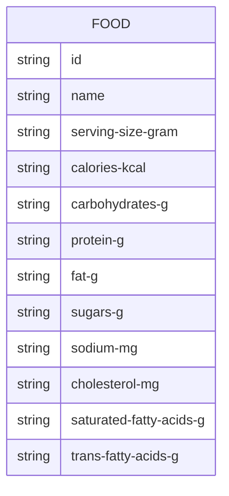

### 요구사항

#### 사용자 요구사항

- 사용자는 식품 이름을 조회해서 식품 정보를 조회한다.
- 사용자는 식품 상세 정보를 조회한다.
- 사용자는 식품 리스트를 조회한다.
- 식품 정보 추가는 [공공 데이터](https://www.data.go.kr/data/15057436/openapi.do)에서 추출한다.
- 식품 정보는 [공공 데이터](https://www.data.go.kr/data/15057436/openapi.do)에서 제공하는 정보를 가져와 저장소에 저장한다.
- [공공 데이터](https://www.data.go.kr/data/15057436/openapi.do)의 트래픽 제한은 10,000 이다.
- 식품 정보 추가는 일회성이다. 재갱신 되지 않는다.

### 이벤트 흐름

### 진행 흐름

### ERD

식품은 식품 이름, 1회 제공량(g), 열량(kcal), 탄수화물(g), 단백질(g), 지방(g), 당류(g), 나트륨(mg), 콜레스테롤(mg), 포화지방산(g), 트랜스지방산(g) 정보를 가진다.

### 모델링

#### Script

- Script File
	- 공공 데이터에서 데이터를 추출해 스토리지에 저장한다.

#### Web Application Server

**Presentation Layer**

- FoodController
	- 사용자는 식품 이름을 조회해서 식품 정보를 조회한다.
	- 사용자는 식품 상세 정보를 조회한다.
	- 사용자는 식품 리스트를 조회한다.

**Service Layer**

- FoodQueryService
	- 식품 이름을 조회해서 식품 정보를 조회한다.
	- 식품 상세 정보를 조회한다.
	- 식품 리스트를 조회한다.

**Domain Layer**

- Food
	- 식품은 식품 이름, 1회 제공량(g), 열량(kcal), 탄수화물(g), 단백질(g), 지방(g), 당류(g), 나트륨(mg), 콜레스테롤(mg), 포화지방산(g), 트랜스지방산(g)으로 구성된다.
